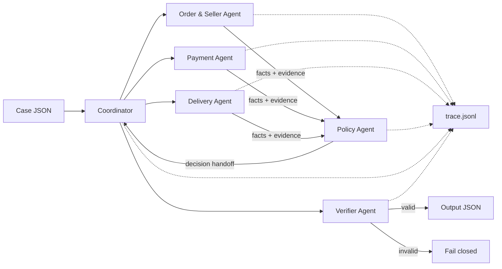

# Kiến trúc Multi-Agent giải quyết khiếu nại Olist

## Mục tiêu thiết kế

Hệ thống tách việc truy xuất sự thật, áp dụng policy, tổng hợp và kiểm chứng thành các agent có contract rõ ràng. LLM không được dùng để tính tiền, tạo evidence ID hoặc thay đổi policy. Nhờ vậy kết quả có thể tái lập và không phụ thuộc vào cách model diễn đạt.

## Vai trò và quyền truy cập

| Agent | Dữ liệu được đọc | Trách nhiệm | Không được phép |
|---|---|---|---|
| Coordinator | Case và handoff | Phân công, ghép output theo schema | Tự tạo facts/evidence |
| Order & Seller | orders, order_items | Status, item/seller, shipping limit, totals | Quyết định refund |
| Payment | order_payments và tổng giá trị item được đối soát | Tổng payment, split payment, reconciliation | Suy đoán refund ledger |
| Delivery | timestamps trong orders | So sánh actual với estimated | Suy đoán tracking checkpoint |
| Policy | Handoff đã cấu trúc | Áp dụng đúng thứ tự EC_POLICY_V1 | Đọc trực tiếp customer message để “tin claim” |
| Verifier | Context gốc và output draft | Chặn ID giả, tiền âm, enum/limit sai | Sửa ngầm output |

## Luồng handoff

1. `OlistStore` nạp CSV ở chế độ chỉ đọc và dựng index theo `order_id`.
2. Khi OpenRouter được bật, Coordinator LLM nhận state và phát đúng một command trong `delegate`, `apply_policy`, `build_draft`, `verify`, `finalize`.
3. Python executor kiểm tra quyền và prerequisite rồi mới thực thi command. Command sai bị reject, lỗi được đưa lại vào state cho turn kế tiếp; tối đa 15 turn và 3 lỗi plan.
4. Mỗi specialist trả `Handoff(agent, case_id, facts, evidence_ids, model_analysis)`. Policy chỉ chạy sau khi đủ ba specialist; finalize chỉ hợp lệ sau verifier.
5. Deterministic guard vẫn tính tiền, áp policy và xác minh evidence nhằm ngăn model bịa dữ liệu. LLM quyết định routing/next step và review domain, không được ghi đè trusted facts.
6. Chỉ output đã qua verifier mới được ghi. Mọi command, handoff, rejection và kết quả inference được ghi trong `trace.jsonl`.

Chế độ `--offline` là fallback tái lập, dùng thứ tự cố định và không được xem là LLM orchestration run để nộp trace.

## OpenRouter và độ tin cậy

Provider là OpenRouter. Model của từng agent được khai báo công khai trong `AGENT_MODEL_CONFIG` tại `src/config.py`; soul và đường dẫn system prompt nằm trong `AGENT_PROMPT_CONFIG`. Nội dung prompt nằm ở `src/prompts/*.md`, được ghép và kiểm tra bởi `src/prompt_registry.py`. `src/openrouter.py` là adapter OpenAI-compatible. Phản hồi model được lưu dưới `model_analysis` để audit và không được ghi đè facts, policy hay financial fields.

Chạy tự động dùng OpenRouter khi có key: `python -m src.main`. Bắt buộc OpenRouter: `python -m src.main --require-openrouter`. Chạy không gọi model: `python -m src.main --offline`. Chạy một case: thêm `--case EC_001`.
