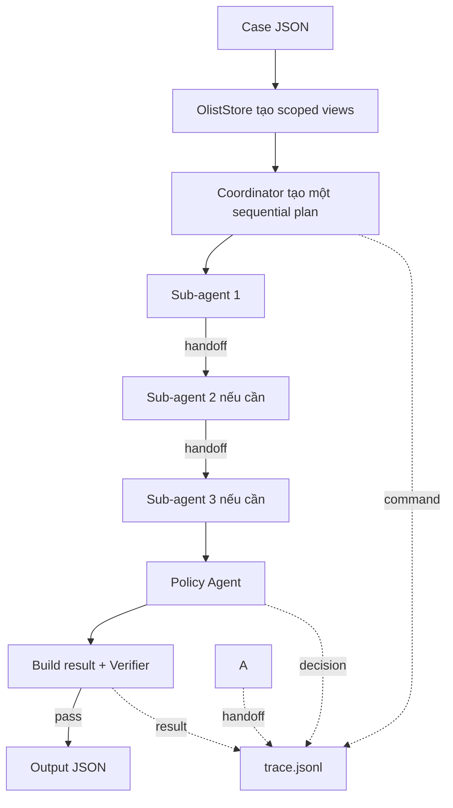

# Kiến trúc đơn luồng Multi-Agent giải quyết khiếu nại Olist

## Nguyên tắc

Mỗi case chạy trên một luồng tuần tự. Tại một thời điểm chỉ có Coordinator hoặc đúng một sub-agent hoạt động. Không dùng fan-out song song và không chia sẻ toàn bộ context cho sub-agent.



“Đơn luồng” ở đây nghĩa là execution tuần tự, không có nghĩa chỉ có một agent. Coordinator chỉ được gọi một lần để trả danh sách agent theo thứ tự. Executor sau đó chạy mỗi agent đúng một lần; không quay lại hỏi Coordinator sau từng handoff.

## Quyền đọc dữ liệu bằng scoped view

`OlistStore` là thành phần duy nhất giữ raw CSV index. Khi đọc một case, store tạo `CaseScopes`; container này chỉ thuộc về executor và không bao giờ được truyền nguyên khối cho sub-agent.

| Agent | Object thực sự nhận | Có thể đọc | Không có quyền/không có thuộc tính |
|---|---|---|---|
| Coordinator | `CaseHeader` + handoff state | case ID, order ID, policy version, facts đã bàn giao | Raw order/items/payments |
| Order & Seller | `OrderSellerScope` | status, carrier handoff, item, seller, shipping limit, price/freight | Payment rows, customer delivery estimate |
| Payment | `PaymentScope` | payment sequence/value và aggregate expected order total | Raw item/seller rows, delivery timestamps |
| Delivery | `DeliveryScope` | actual và estimated delivery timestamps | Payments, item prices, sellers |
| Policy | `CaseHeader` + specialist facts | Facts đã qua handoff và policy version | Raw CSV rows |
| Verifier | `VerificationScope` + output candidate | Tập evidence ID hợp lệ và case header | Raw business rows |

Các contract nằm trong `src/contracts.py`. Phép chiếu raw CSV thành scope nằm trong `src/data_store.py`. `_scope_for()` trong `src/orchestrator.py` là capability router: target agent nào chỉ nhận scope của agent đó.

Ví dụ Payment Agent nhận:

```text
PaymentScope
├── header
├── payments(payment_sequential, payment_value)
└── expected_order_total_brl
```

Nó không thể truy cập `seller_id`, `shipping_limit_date` hoặc delivery timestamps vì các field này không tồn tại trong object được truyền vào. Đây là giới hạn ở data contract, không chỉ là lời nhắc trong prompt.

## Luồng một case

1. Main nạp `.env`, kiểm tra model/prompt registry và xóa trace cũ.
2. Store đọc `claimed_order_id`, truy xuất raw rows rồi tạo các scoped view bất biến.
3. Coordinator LLM nhìn `CaseHeader` và trả một sequential plan duy nhất.
4. Executor chạy lần lượt các agent trong plan, mỗi agent nhận đúng scoped view của mình.
5. Mỗi sub-agent tạo handoff và executor ghi trace.
6. Policy áp dụng `EC_POLICY_V1`; code dựng result; Verifier kiểm tra evidence/schema/tiền.
7. Result hợp lệ được ghi vào `output/`.

Chế độ `--offline` vẫn tuần tự nhưng dùng thứ tự cố định để test. Chế độ `--require-openrouter` dùng Coordinator LLM quyết định từng bước.

## Cấu hình agent

- Model: `AGENT_MODEL_CONFIG` trong `src/config.py`.
- Soul và prompt file: `AGENT_PROMPT_CONFIG` trong `src/config.py`.
- System prompts: `src/prompts/*.md`.
- Prompt composition: `src/prompt_registry.py`.
- OpenRouter adapter: `src/openrouter.py`.

Chạy một case qua OpenRouter:

```bash
python -m src.main --require-openrouter --case EC_001
```

Chạy kiểm thử không gọi API:

```bash
python -m src.main --offline
```
