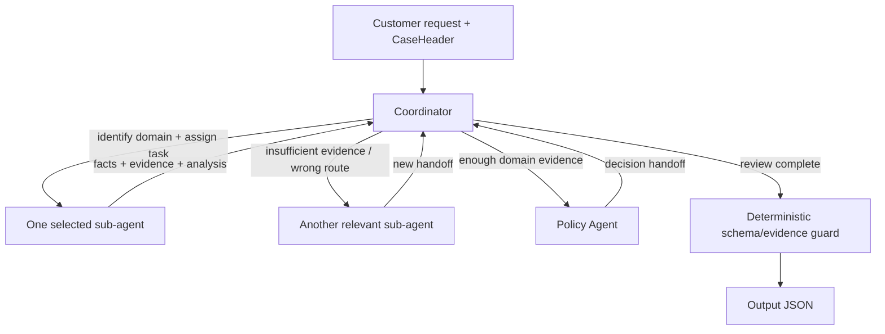

# Kiến trúc Adaptive Single-Thread Multi-Agent

## Luồng chính

Mỗi case chạy tuần tự. Coordinator là agent duy nhất quyết định routing và kiểm tra mức độ đầy đủ của kết quả.



Coordinator được gọi lại sau mỗi handoff, nhưng tại một thời điểm chỉ một sub-agent chạy. Không fan-out song song và không bắt buộc gọi agent không liên quan. Vòng routing có giới hạn 8 turn và chỉ cho phép đúng 1 corrective re-route. Lỗi route lần hai hoặc hết 8 turn sẽ kích hoạt deterministic fallback để hoàn thành case, không dừng toàn bộ lượt chạy.

## Nhiệm vụ Coordinator

- Đọc customer request, order status và state hiện tại.
- Xác định domain còn thiếu bằng chứng.
- Giao một task cụ thể cho đúng sub-agent.
- Đọc handoff và quyết định route tiếp, gọi Policy, hoặc finalize.
- Phát hiện route sai, agent thiếu evidence hoặc Policy được gọi quá sớm.
- Kiểm tra tính đầy đủ trước khi tạo output.

Catalog đầy đủ về nhiệm vụ, quyền dữ liệu và thời điểm gọi từng sub-agent nằm trực tiếp trong `src/prompts/coordinator.md`.

## Sub-agent

| Agent | Nhiệm vụ | Scoped data |
|---|---|---|
| Order & Seller | Status, item/seller, shipping limit, item/freight totals | `OrderSellerScope` |
| Payment | Payment total, split payment, reconciliation | `PaymentScope` |
| Delivery | Actual delivery so với estimate | `DeliveryScope` |
| Policy | Áp dụng priority EC_POLICY_V1 trên facts đã thu thập | `CaseHeader` + handoffs |

Không còn `VerifierAgent`. Việc kiểm tra cuối nằm trong `src/validation.py`; đây là hard gate Python, không có soul/model/prompt và không phát sinh API call.

## Data access thực tế

`OlistStore` giữ raw CSV và tạo `CaseScopes`. Executor chỉ truyền projection tương ứng:

- Coordinator nhận `CaseHeader`, customer request và handoffs; không nhận raw CSV rows.
- Order/Seller không có payment hoặc customer-delivery fields.
- Payment chỉ có payment rows và expected-total aggregate; không có seller/items raw.
- Delivery chỉ có hai delivery timestamps.
- Policy chỉ có facts do các agent khác bàn giao.

Các dataclass là frozen và nằm trong `src/contracts.py`. Capability routing nằm tại `_scope_for()` trong `src/orchestrator.py`.

## Trace

Các event quan trọng:

- `route_decision`: Coordinator chọn agent hoặc finalize.
- `route_rejected`: route/response không hợp lệ.
- `handoff`: sub-agent trả facts và evidence.
- `result_rejected`: output chưa đủ hoặc không qua hard gate.
- `result_checked`: output cuối hợp lệ.

Chạy một case trước:

```bash
python -m src.main --require-openrouter --case EC_001
```
